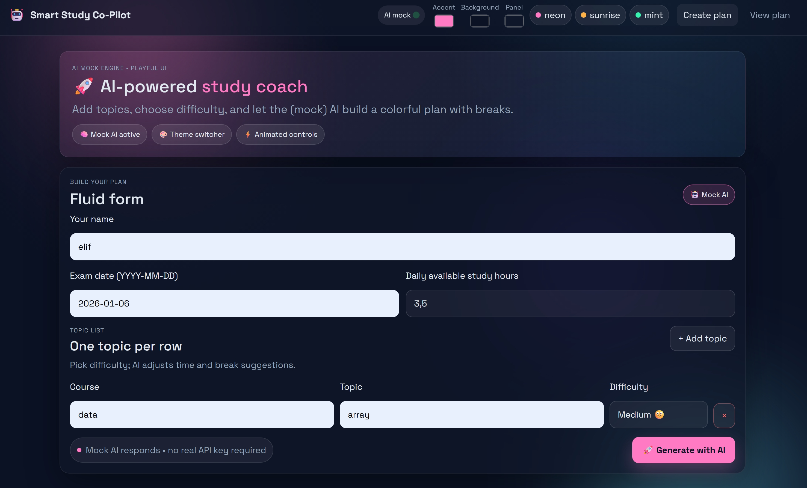
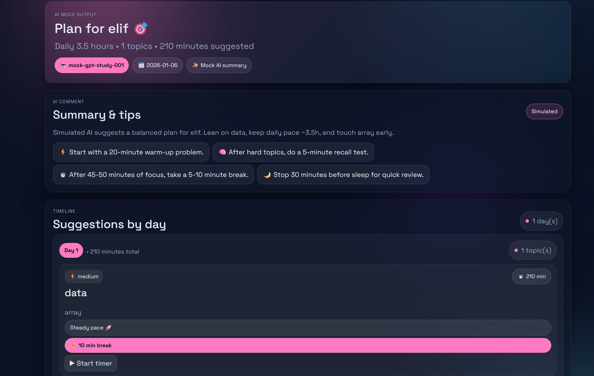

# 🎓 Smart Study Planner

A full-stack web application that helps students transform their topics, deadlines, and available study hours into a personalized, realistic daily study plan.

This project was built as a portfolio piece for software engineering internship applications.  
It demonstrates skills in **Python (Flask), React, TypeScript, routing, UI design, and API integration.**

---

## ✨ Features

### ✅ Create a study plan in seconds
- Enter your name, courses, and multiple topics.
- Choose difficulty (Easy / Medium / Hard).
- Provide your available hours per day.
- Select the nearest exam date.
- Get an automatically generated daily plan.

### 🔍 Difficulty-aware time suggestions
Harder topics receive more minutes, keeping the plan balanced and realistic.

### 📚 Multi-topic & multi-course support
A single course can include multiple topics (Example: *Data Structures → Arrays, Trees, Graphs…*)

### 🖥️ Clean & responsive UI
Built with:
- React + TypeScript  
- React Router  
- Bootstrap  

The app includes:
- A form page to create a plan  
- A separate results page to view the generated schedule  

---
## 📸 Screenshots

### 📝 Create Plan Page
This screen allows the student to enter topics, courses, difficulty levels, study hours, and the exam date.



### 📊 Generated Study Plan Page
After submitting the form, the app generates a daily structured study plan.




## 🧱 Tech Stack

### **Frontend**
- React  
- TypeScript  
- React Router  
- Bootstrap / CSS  

### **Backend**
- Python  
- Flask  

---

## 📁 Project Structure (Simplified)

smart-study-planner/
├─ app.py # Flask backend
├─ requirements.txt # Python dependencies
├─ package.json # Frontend configuration
├─ src/
│ ├─ index.tsx # React entry point
│ ├─ App.tsx # Routing + layout
│ ├─ App.css
│ └─ components/
│ ├─ Navbar.tsx
│ ├─ StudyPlanForm.tsx
│ └─ StudyPlanView.tsx
└─ templates/
├─ base.html
├─ index.html
└─ plan.html

---

## 🚀 Getting Started

### **1️⃣ Clone the project**
```bash
git clone https://github.com/elifbugdayy/smart-study-planner.git
cd smart-study-planner
🖥️ Run the Frontend (React + TypeScript)
Install dependencies
npm install

Start development server
npm start


The React app will run at:
👉 http://localhost:3000
🐍 Run the Backend (Flask)
Create and activate virtual environment
python -m venv .venv
.venv\Scripts\activate

Install backend dependencies
pip install -r requirements.txt

Start server
python app.py


The Flask server runs at:
👉 http://localhost:5000
🎯 Why I Built This Project

This project was developed as part of my software engineering internship portfolio.
My goals were:

Practice full-stack development

Build a clean and functional UI

Work with both Python + React

Learn API integration

Create a real, deployable application

👩‍💻 Author

Elif Buğday
GitHub: @elifbugdayy

Email: elifbugday06@gmail.com
